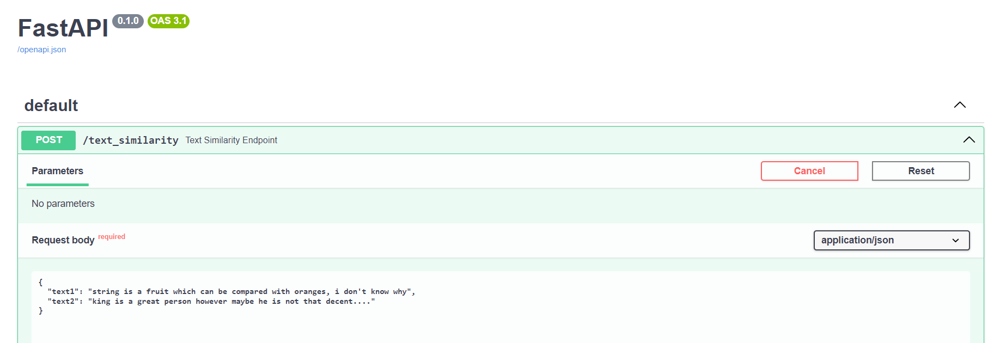
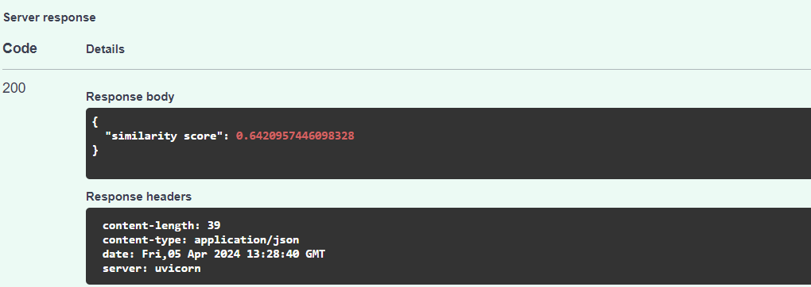

In the script “main.py”, I trained a Word2Vec model using text data from provided DataNeuron Text
Similarity .CSV file that contains two columns “text1” and “text2”.

• A Pydantic model ‘TextPair’ with two text fields (‘text1’ and ‘text2’) that serve as the data structure for
incoming requests, ensuring structured and validated input for the similarity calculation.

• Function “calculate_similarity” calculates the similarity between two pieces of text, by tokenizing
the input texts, transforming them into their respective Word2Vec embeddings, and then computing
the cosine similarity between the resulting vectors.

• And then, I defined a POST endpoint ‘/text_similarity’ where users can submit two pieces of texts i.e.
“text1” and “text2”. The endpoint uses the calculate_similarity function to compute and return the
similarity score between the provided texts.

• Run the python script “main.py” using command:
python -m uvicorn main:app --host 0.0.0.0 --port 8000 –reload

• Required packages:
• Once Application startup is complete, go to the link:
http://localhost:8000/docs

• “Try it out” and give “text1” and “text2” to check “similarity score”

• Remember to use meaningful words!!

<figure class="half">
    
</figure>

<figure class="half">
    
</figure>
